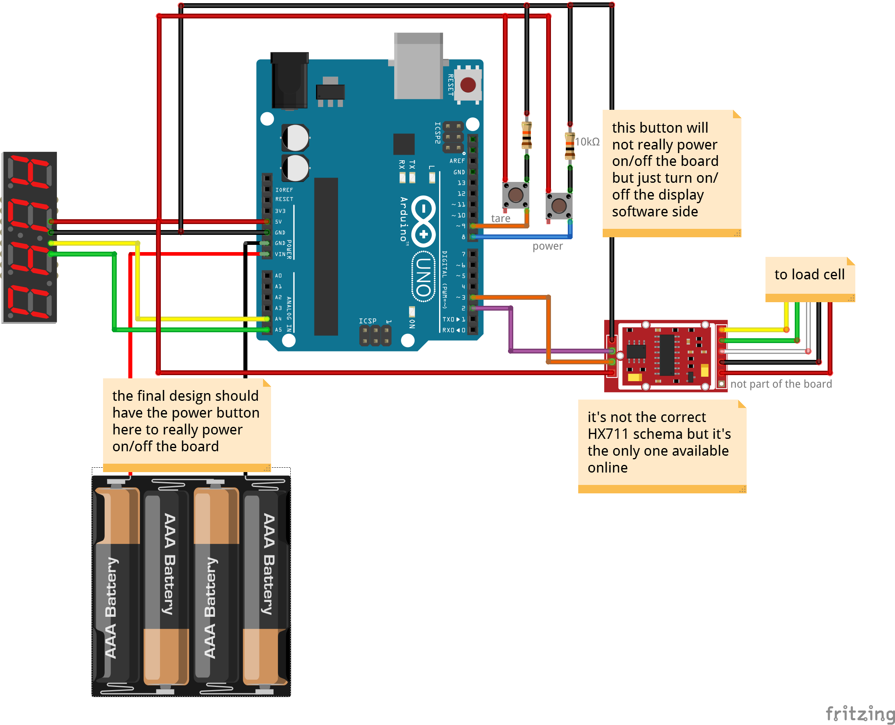

# Project description

A friend of mine needed to design a scale for a school project and asked me to make it functional.
We opted for a custom Arduino-based solution to be able to integrate it easily in the existing design.

# Bill of materials
* [Arduino UNO R3 **$24.95**](https://www.adafruit.com/product/50)
* [Load cell 10kg **$6.95**](https://www.sparkfun.com/products/13329)
* [Load cell amplifier **$9.95**](https://www.sparkfun.com/products/13879)
* [0.56" 4-digit 7-segment display **$9.95**](https://www.adafruit.com/product/878)
* [cables **$2**](https://www.sparkfun.com/products/12795)
* [2x 10kΩ resistors **$1**](https://www.sparkfun.com/products/11508)
* [2x push-buttons **$1**](https://www.sparkfun.com/products/97)
* [Battery holder 4xAA **$1.95**](https://www.sparkfun.com/products/552)

Estimated total: ~**$58**

# Schematics

The schematic was done using [Fritzing](http://fritzing.org/home/). You can find the source inside the folder *schema*

# Software
See code in *arduino_code* folder

Library used:
* https://github.com/adafruit/Adafruit-GFX-Library
* https://github.com/bogde/HX711
* https://github.com/sparkfun/HX711-Load-Cell-Amplifier